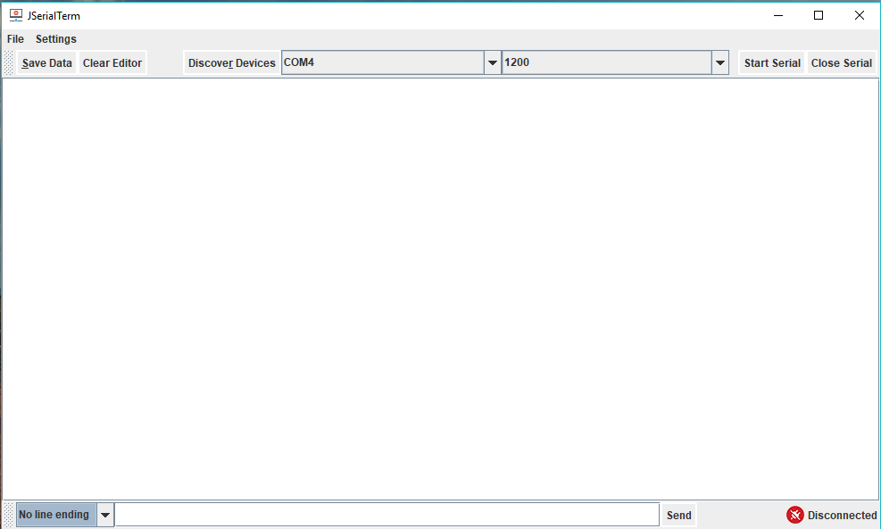
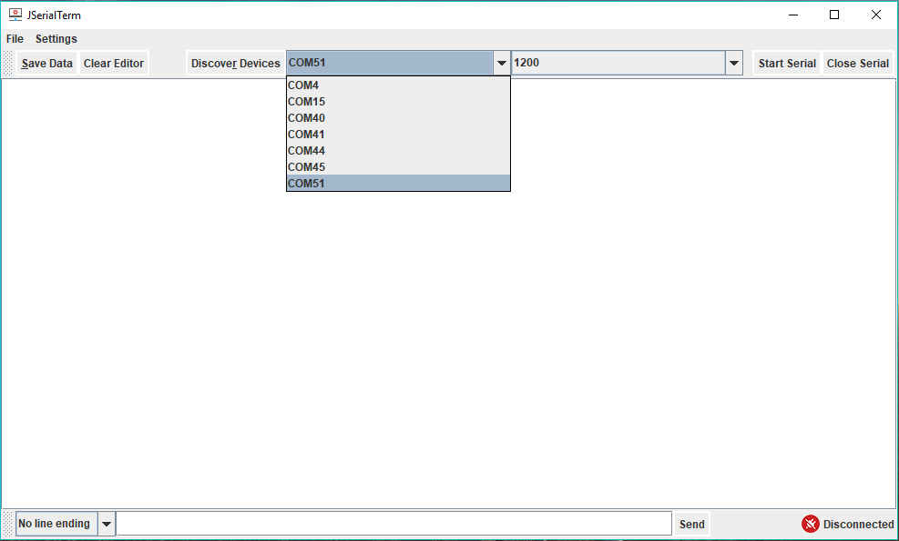
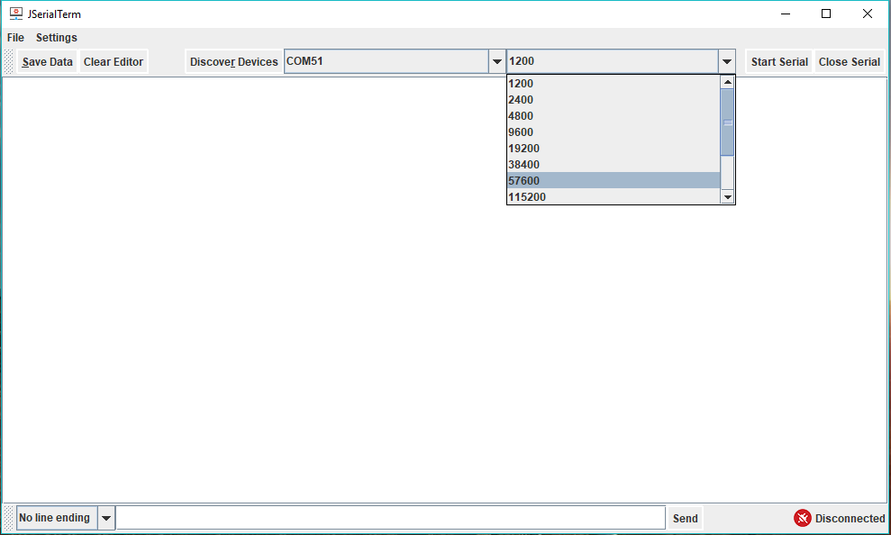
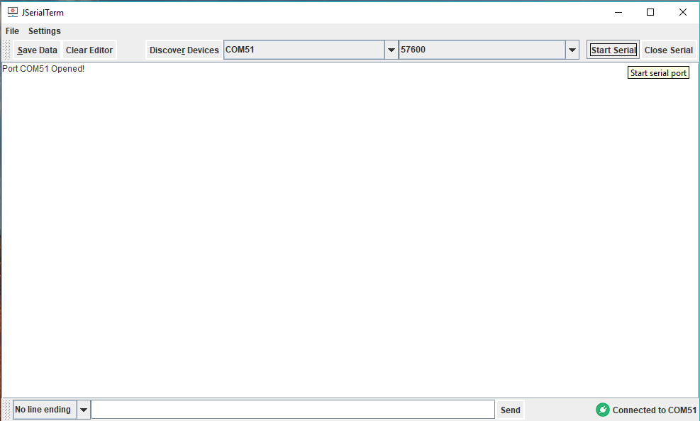

# JSerialTerminal
Application enabling simple and intuitive handling serial communication. 
- Primary intention of such design is the simplicity of saving serial data to the files for further use. 
- It makes it very easy to make simple editions and save data to files as csv and use it further with Matlab, Excel and similar 

## Usage
- Feel free to change it to any extent you may need! 
- If you do not wish to do any changes to the program you can just double click on the `JSerialTerminal.jar` file and run the application.

## Ecliplse project
1. Clone the project
2. Open Ecliplse (I use Eclipse Neon)
3. Go to File > Open Projects From file systems
4. Navigate and open you the project
5. Run the code

#### Export as runnable jar
1. Right click on project
2. Export > Java > Runnable JAR file 
3. **Make sure you check 'Package required libraries into generated JAR'**

